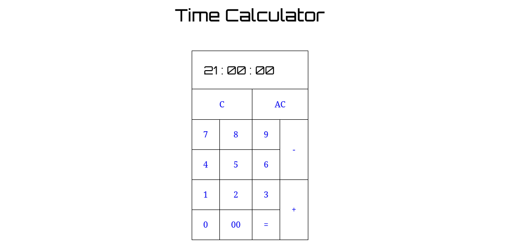

# JavaScript Time Calculator

A simple web-based time calculator built with JavaScript, HTML, and CSS.



## 🐳 Run with Docker

1. Run application using docker compose

```bash
docker compose up -d
```

2. Open [http://localhost:8080](http://localhost:8080) in your browser.

## 📦 Build Image and Run Container From Docker Hub

1. Build the Docker image:
   
   ```bash
   docker container run -d -p 8080:80 sabagh/js-time-calculator .
   ```
2. Open [http://localhost:8080](http://localhost:8080) in your browser.
